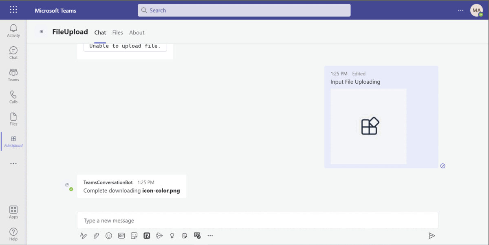
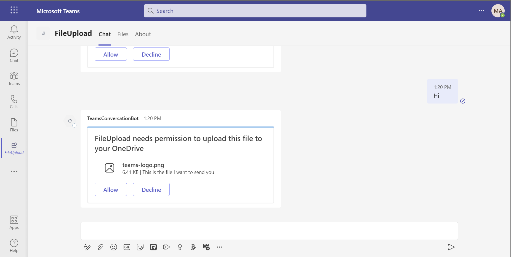
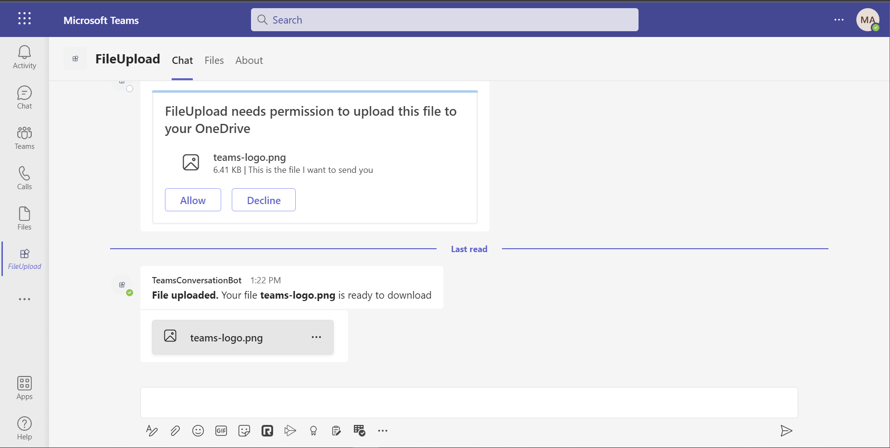

# Teams File Upload Bot

Bot Framework v4 file upload bot sample for Teams.

This bot has been created using [Bot Framework](https://dev.botframework.com), it shows how to
upload files to Teams from a bot and how to receive a file sent to a bot as an attachment.

## Included Features
* Bots
* Adaptive Cards

## Interaction with bot


 ## Try it yourself - experience the App in your Microsoft Teams client
Please find below demo manifest which is deployed on Microsoft Azure and you can try it yourself by uploading the app package (.zip file link below) to your teams and/or as a personal app. (Sideloading must be enabled for your tenant, [see steps here](https://docs.microsoft.com/microsoftteams/platform/concepts/build-and-test/prepare-your-o365-tenant#enable-custom-teams-apps-and-turn-on-custom-app-uploading)).

**Teams File Upload Bot:** [Manifest](/samples/bot-file-upload/csharp/demo-manifest/bot-file-upload.zip)

## Prerequisites

- Microsoft Teams is installed and you have an account
- [ngrok](https://ngrok.com/) or equivalent tunnelling solution


## To try this sample

> Note these instructions are for running the sample on your local machine, the tunnelling solution is required because
the Teams service needs to call into the bot.

This bot has been created using [Bot Framework](https://dev.botframework.com), it shows how to create a simple bot that accepts input from the user and echoes it back.

1) Clone the repository

    ```bash
    git clone https://github.com/OfficeDev/Microsoft-Teams-Samples.git
    ```

1) Run ngrok - point to port 3978

    ```bash
    ngrok http 3978 --host-header="localhost:3978"
    ```

1) Create [Bot Framework registration resource](https://docs.microsoft.com/azure/bot-service/bot-service-quickstart-registration) in Azure
    - Use the current `https` URL you were given by running ngrok. Append with the path `/api/messages` used by this sample
    - Ensure that you've [enabled the Teams Channel](https://docs.microsoft.com/azure/bot-service/channel-connect-teams?view=azure-bot-service-4.0)
    - __*If you don't have an Azure account*__ you can use this [Bot Framework registration](https://docs.microsoft.com/microsoftteams/platform/bots/how-to/create-a-bot-for-teams#register-your-web-service-with-the-bot-framework)

1) Bring up a terminal, navigate to `Microsoft-Teams-Samples\samples\bot-file-upload` folder

1) Activate your desired virtual environment

1) Install dependencies by running ```pip install -r requirements.txt``` in the project folder.

1) Update the `config.py` configuration for the bot to use the Microsoft App Id and App Password from the Bot Framework registration. (Note the App Password is referred to as the "client secret" in the azure portal and you can always create a new client secret anytime.)

1) __*This step is specific to Teams.*__
    - **Edit** the `manifest.json` contained in the `teamsAppManifest` folder to replace your Microsoft App Id (that was created when you registered your bot earlier) *everywhere* you see the place holder string `<<YOUR-MICROSOFT-APP-ID>>` (depending on the scenario the Microsoft App Id may occur multiple times in the `manifest.json`)
    - **Zip** up the contents of the `teamsAppManifest` folder to create a `manifest.zip`
    - **Upload** the `manifest.zip` to Teams (in the Apps view click "Upload a custom app")

1) Run your bot with `python app.py`

## Interacting with the bot in Teams

> Note this `manifest.json` specified that the bot will be installed in "personal" scope which is why you immediately entered a one on one chat conversation with the bot. Please refer to Teams documentation for more details.

Sending a message to the bot will cause it to respond with a card that will prompt you to upload a file. The file that's being uploaded is the `teams-logo.png` in the `Files` directory in this sample. The `Accept` and `Decline` events illustrated in this sample are specific to Teams. You can message the bot again to receive another prompt.

You can also send a file to the bot as an attachment in the message compose section in Teams. This will be delivered to the bot as a Message Activity and the code in this sample fetches and saves the file.

## Running the sample

> Note this `manifest.json` specified that the bot will be installed in "personal" scope which is why you immediately entered a one on one chat conversation with the bot. Please refer to Teams documentation for more details.

The bot initialization welcome message


The bot will respond to the message when you upload a file


The bot sends message to download file.


## Deploy the bot to Azure

To learn more about deploying a bot to Azure, see [Deploy your bot to Azure](https://aka.ms/azuredeployment) for a complete list of deployment instructions.

# Further reading

- [Upload Files Using Bots](https://learn.microsoft.com/en-us/microsoftteams/platform/bots/how-to/bots-filesv4)
- [Bot Framework Documentation](https://docs.botframework.com)
- [Bot Basics](https://docs.microsoft.com/azure/bot-service/bot-builder-basics?view=azure-bot-service-4.0)
- [Azure Bot Service Introduction](https://docs.microsoft.com/azure/bot-service/bot-service-overview-introduction?view=azure-bot-service-4.0)
- [Azure Bot Service Documentation](https://docs.microsoft.com/azure/bot-service/?view=azure-bot-service-4.0)

