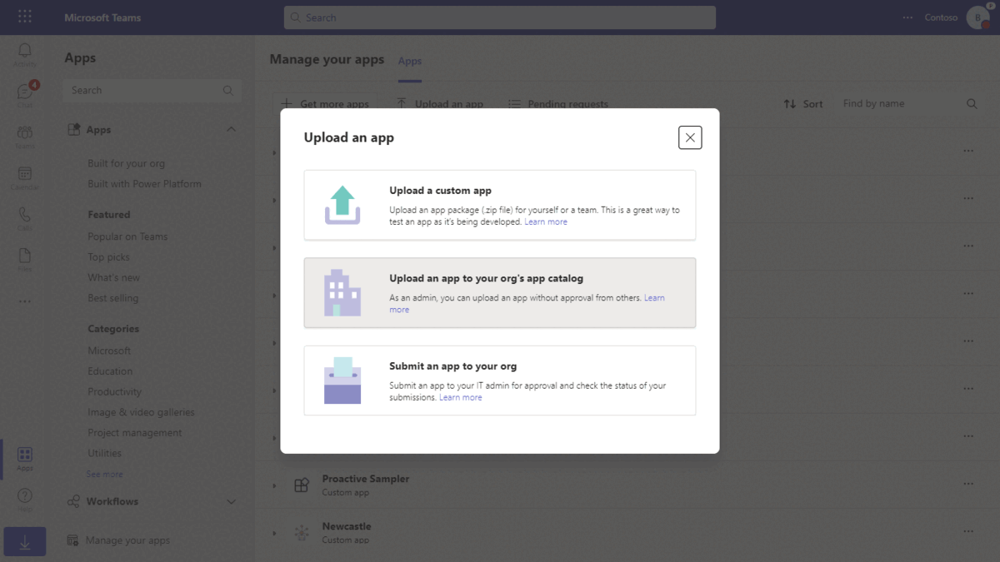
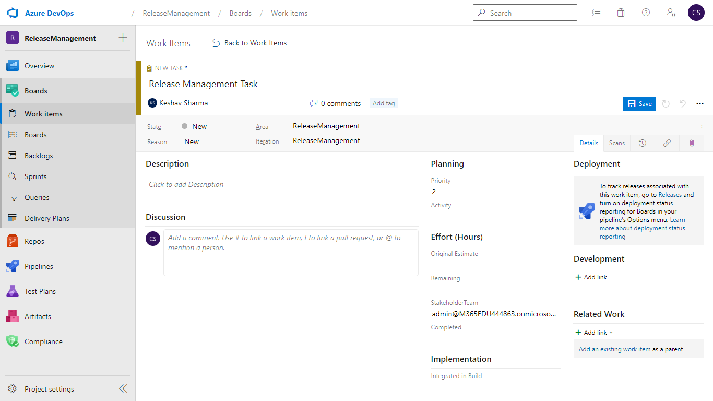
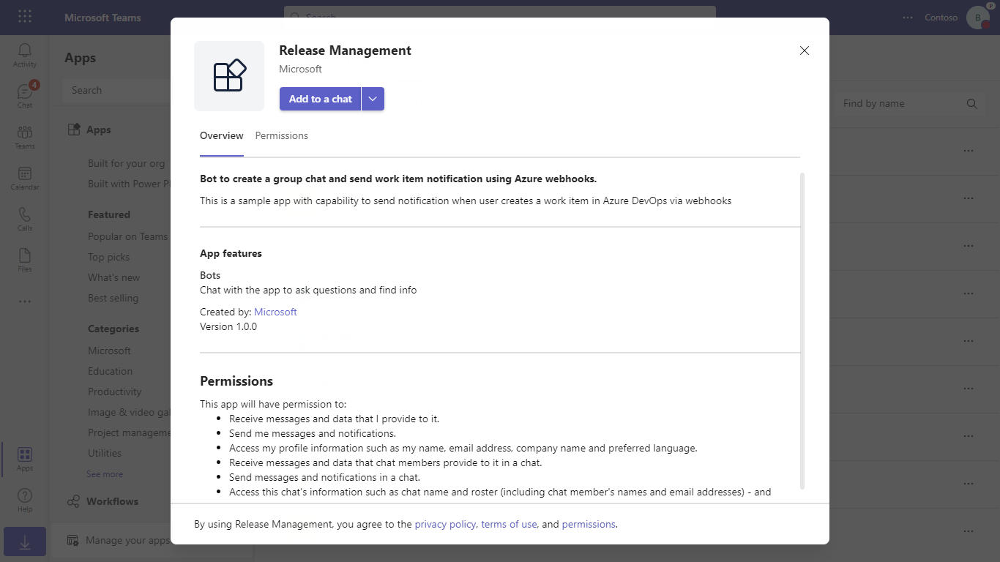
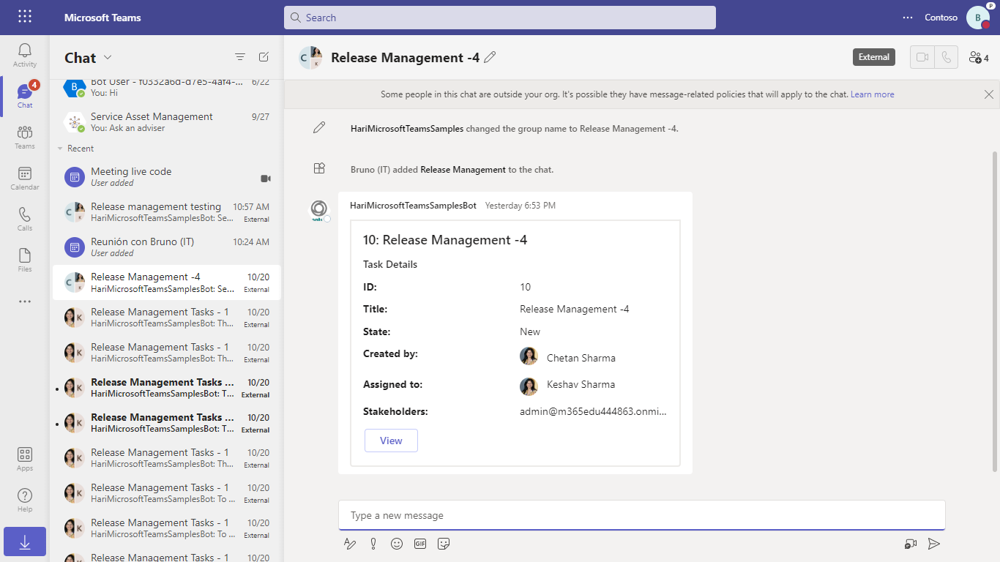

# Bot to create the group chat and send task notification using Azure service hook

This is a sample application which demonstrates how to create a service hooks on [Azure DevOps](https://dev.azure.com) and connect with Teams bot that creates a group chat and send workitems details.

## Included Features
* Bots
* Adaptive Cards

## Interaction with app



## Prerequisites
 [.NET Core SDK](https://dotnet.microsoft.com/en-us/download) version 6.0

  ```bash
  # determine dotnet version
  dotnet --version
  ```
- Publicly addressable https url or tunnel such as [ngrok](https://ngrok.com/) or [Tunnel Relay](https://github.com/OfficeDev/microsoft-teams-tunnelrelay) 

- [Azure DevOps](https://dev.azure.com) access to set up service hooks and add custom field in workitem.

## Setup

**Setup NGROK**
1) Run ngrok - point to port 3978

```bash
# ngrok http 3978 --host-header="localhost:3978"
```
2) Once started you should see ngrok URL like `https://xxxxx-xxx-e125.ngrok-free.app`. Copy it, this is your baseUrl that will used as endpoint for Azure bot and webhook.

**Register Azure AD application**

Register one Azure AD application in your tenant's directory: for the bot and tab app authentication.

-  Log in to the Azure portal from your subscription, and go to the "App registrations" blade  [here](https://portal.azure.com/#blade/Microsoft_AAD_IAM/ActiveDirectoryMenuBlade/RegisteredApps). Ensure that you use a tenant where admin consent for API permissions can be provided.

-  Click on "New registration", and create an Azure AD application.

-  **Name:**  The name of your Teams app - if you are following the template for a default deployment, we recommend "Bot release management".

-  **Supported account types:**  Select "Accounts in any organizational directory"

-  Leave the "Redirect URL" field blank.   

- Click on the "Register" button.

- When the app is registered, you'll be taken to the app's "Overview" page. Copy the  **Application (client) ID**; we will need it later. Verify that the "Supported account types" is set to  **Multiple organizations**.

-  On the side rail in the Manage section, navigate to the "Certificates & secrets" section. In the Client secrets section, click on "+ New client secret". Add a description for the secret and select Expires as "Never". Click "Add".

-  Once the client secret is created, copy its  **Value**, please take a note of the secret as it will be required later.


- At this point you have 3 unique values:
    -   Application (client) ID which will be later used during Azure bot creation
    -   Client secret for the bot which will be later used during Azure bot creation
    -   Directory (tenant) ID
We recommend that you copy these values into a text file, using an application like Notepad. We will need these values later.

-  Under left menu, navigate to  **API Permissions**, and make sure to add the following permissions of Microsoft Graph API > Application permissions:
    -  Chat.Create
    -  TeamsAppInstallation.ReadWriteForChat.All
    -  AppCatalog.Read.All
    -  User.Read.All

Click on Add Permissions to commit your changes.

- If you are logged in as the Global Administrator, click on the Grant admin consent for %tenant-name% button to grant admin consent else, inform your admin to do the same through the portal or follow the steps provided here to create a link and send it to your admin for consent.

- Global Administrator can grant consent using following link:  [https://login.microsoftonline.com/common/adminconsent?client_id=](https://login.microsoftonline.com/common/adminconsent?client_id=)<%appId%> 

**Setup for Bot**

- Register a bot with Azure Bot Service, following the instructions [here](https://docs.microsoft.com/en-us/azure/bot-service/bot-service-quickstart-registration?view=azure-bot-service-3.0).

- Ensure that you've [enabled the Teams Channel](https://docs.microsoft.com/en-us/azure/bot-service/channel-connect-teams?view=azure-bot-service-4.0)

- While registering the bot, use `https://<your_ngrok_url>/api/messages` as the messaging endpoint.
    > NOTE: When you create your bot you will create an App ID and App password - make sure you keep these for later.

**Setup Azure DevOps service hook**

- Follow this document- [Create Webhooks](https://docs.microsoft.com/en-us/azure/devops/service-hooks/services/webhooks?view=azure-devops) to service hook. 

- Make sure to select trigger as *Work item created*

- Make sure to add URL as https://{baseUrl}/api/workItem. It will look somethihng as https://41ed-abcd-e125.ngrok-free.app/api/workItem. *Here baseUrl is referred to URL we get in step 2*.

**NOTE: If you are not getting incoming request from Azure DevOps make sure that service webhook is in *Enabled* state.**

**Setup custom work item type**

- Follow the doc to [Add a custom field to an inherited process - Azure DevOps Services](https://docs.microsoft.com/en-us/azure/devops/organizations/settings/work/add-custom-field?view=azure-devops). 

- Make sure to give name as *StakeholderTeam* and Type *Text (Single line)*


- Make sure to [Apply the customized process to your project](https://docs.microsoft.com/en-us/azure/devops/organizations/settings/work/add-custom-field?view=azure-devops#apply-the-customized-process-to-your-project)

- Go to *Options* and check *Required* and Add.

**NOTE: Make sure you create a new task, click save and verify the stakeholderTeam value**


**Setup for code**
- Clone the repository

    ```bash
    git clone https://github.com/OfficeDev/Microsoft-Teams-Samples.git
    ```

- Run the bot from a terminal or from Visual Studio:

  A) From a terminal, navigate to `ReleaseManagement`

  ```bash
  # run the bot
  dotnet run
  ```

  B) Or from Visual Studio

  - Launch Visual Studio
  - File -> Open -> Project/Solution
  - Navigate to `samples/release-management/csharp` folder
  - Select `ReleaseManagement.csproj` file
  - Press `F5` to run the project

- Update the `appsettings.json` configuration for the bot to use the `MicrosoftAppId`, `MicrosoftAppPassword` and `MicrosoftAppTenantId` generated in previous steps 1 (Setup for AAD app registration). (Note the App Password is referred to as the "client secret" in the azure portal and you can always create a new client secret anytime.)

**Setup Manifest for Teams**

- **This step is specific to Teams.**
    - **Edit** the `manifest.json` contained in the  `AppManifest` folder to replace your Microsoft App Id (that was created when you registered your bot earlier) *everywhere* you see the place holder string `<<Your Microsoft App Id>>` (depending on the scenario the Microsoft App Id may occur multiple times in the `manifest.json`)
    - **Edit** the `manifest.json` for `validDomains` with base Url domain. E.g. if you are using ngrok it would be `https://1234.ngrok-free.app` then your domain-name will be `1234.ngrok-free.app`.
    - **Zip** up the contents of the `AppManifest` folder to create a `manifest.zip` (Make sure that zip file does not contains any subfolder otherwise you will get error while uploading your .zip package)
    - **Upload** the `manifest.zip` to Teams (In Teams Apps/Manage your apps click "Upload an app to your org's app catalog". Browse to and Open the .zip file. At the next dialog, click the Add button.)
    - Add the app to personal/team/groupChat scope (Supported scopes)

**Note**: If you are facing any issue in your app, please uncomment [this](https://github.com/OfficeDev/Microsoft-Teams-Samples/blob/main/samples/bot-release-management/csharp/ReleaseManagement/AdapterWithErrorHandler.cs#L22) line and put your debugger for local debug.

## Running the sample

**Upload an app to your org's app catalog:**


**Install App:**



**Add Release Management:**


**WorkItem Card UI:**



**View UI:**


**Interacting with the bot**
- Login into [Azure DevOps](https://dev.azure.com) and open the project where custom process was applied.
- Create a new workitem -> Tasks, provide comma seprated email ids in *StakeHolderTeam* 
(NOTE: The email should belong to tenant where we register Application in step 1
- Save
- Bot will create the group chat with members you added and send the Task details.

## Deploy the bot to Azure

To learn more about deploying a bot to Azure, see [Deploy your bot to Azure](https://aka.ms/azuredeployment) for a complete list of deployment instructions.

## Further reading
- [Integrate with service hooks](https://learn.microsoft.com/en-us/azure/devops/service-hooks/overview?source=recommendations&view=azure-devops)
- [Bot Framework Documentation](https://docs.botframework.com)
- [Bot Basics](https://docs.microsoft.com/azure/bot-service/bot-builder-basics?view=azure-bot-service-4.0)
- [Azure Portal](https://portal.azure.com)
- [Add Authentication to Your Bot Via Azure Bot Service](https://docs.microsoft.com/en-us/azure/bot-service/bot-builder-authentication?view=azure-bot-service-4.0&tabs=csharp)
- [Azure Bot Service Introduction](https://docs.microsoft.com/azure/bot-service/bot-service-overview-introduction?view=azure-bot-service-4.0)
- [Azure Bot Service Documentation](https://docs.microsoft.com/azure/bot-service/?view=azure-bot-service-4.0)
- [.NET Core CLI tools](https://docs.microsoft.com/en-us/dotnet/core/tools/?tabs=netcore2x)
- [Microsoft Teams Developer Platform](https://docs.microsoft.com/en-us/microsoftteams/platform/)


