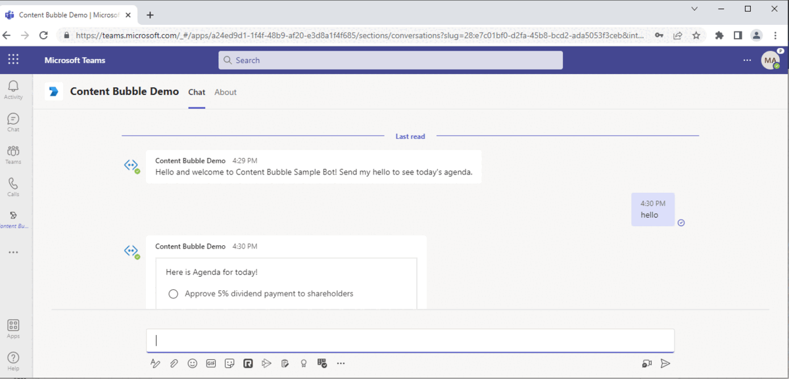
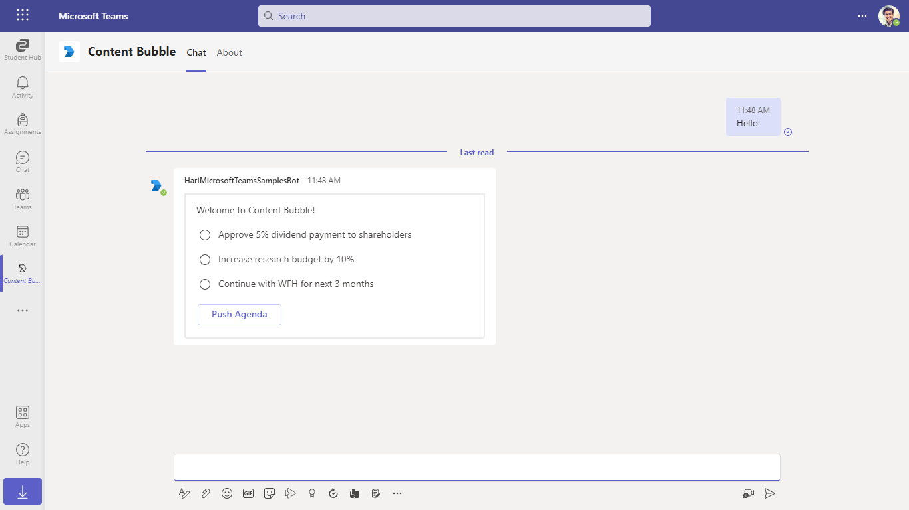
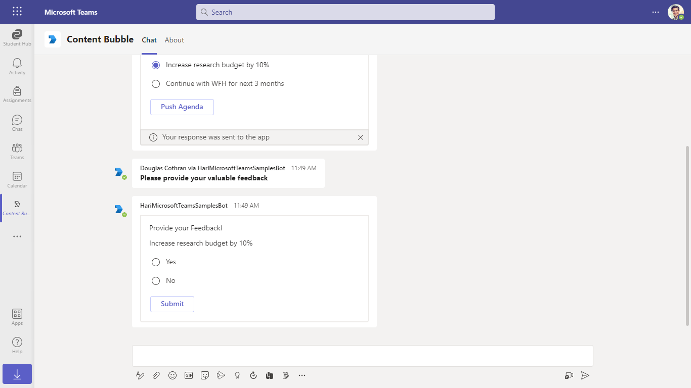
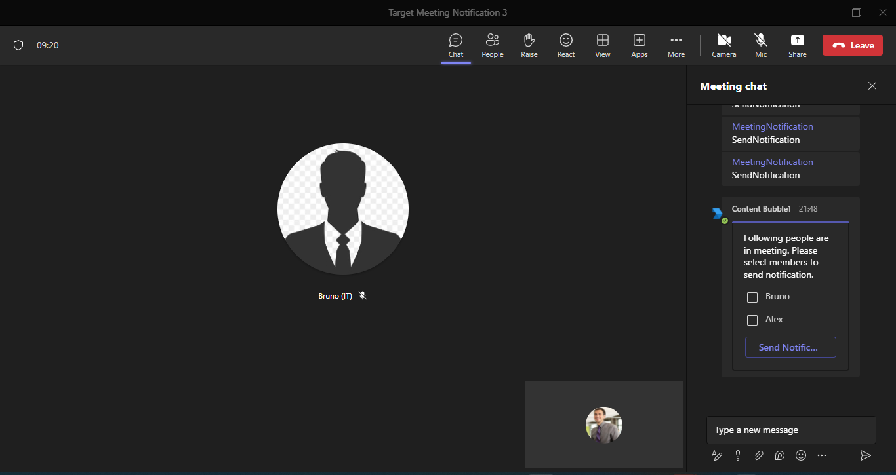
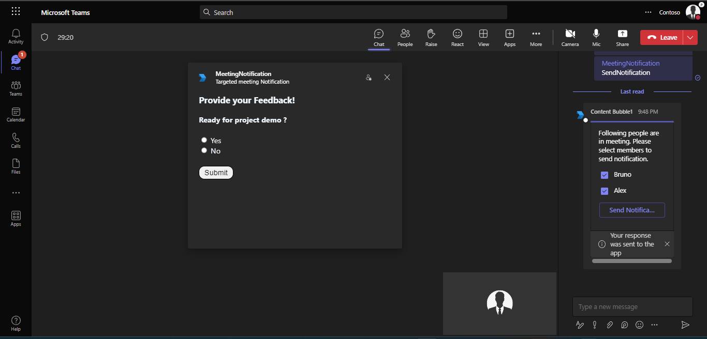

## Targeted In-Meeting Notification

This sample illustrates how to implement [Targeted In-Meeting Notification](https://learn.microsoft.com/microsoftteams/platform/apps-in-teams-meetings/meeting-apps-apis?branch=pr-en-us-7615&tabs=dotnet#targeted-meeting-notification-api)  In-Meeting Experience.

## Included Features
* Bots
* In-Meeting Notifications
* Adaptive Cards
* RSC Permissions

## Interaction with app



## Try it yourself - experience the App in your Microsoft Teams client
Please find below demo manifest which is deployed on Microsoft Azure and you can try it yourself by uploading the app package (.zip file link below) to your teams and/or as a personal app. (Sideloading must be enabled for your tenant, [see steps here](https://docs.microsoft.com/microsoftteams/platform/concepts/build-and-test/prepare-your-o365-tenant#enable-custom-teams-apps-and-turn-on-custom-app-uploading)).

**Meetings Content Bubble:** [Manifest](/samples/meetings-content-bubble/csharp/demo-manifest/meetings-content-bubble.zip)

## Prerequisites

- To test locally, [NodeJS](https://nodejs.org/en/download/) must be installed on your development machine (version 16.14.2  or higher).

    ```bash
    # determine node version
    node --version
    ```
- Office 365 tenant. You can get a free tenant for development use by signing up for the [Office 365 Developer Program](https://developer.microsoft.com/microsoft-365/dev-program).

- To test locally, you'll need [Ngrok](https://ngrok.com/) installed on your development machine.
Make sure you've downloaded and installed Ngrok on your local machine. ngrok will tunnel requests from the Internet to your local computer and terminate the SSL connection from Teams.

## Setup

> NOTE: The free ngrok plan will generate a new URL every time you run it, which requires you to update your Azure AD registration, the Teams app manifest, and the project configuration. A paid account with a permanent ngrok URL is recommended.

1) Setup for Bot
- Register Azure AD application resource in Azure portal
- In Azure portal, create a [Azure Bot resource](https://docs.microsoft.com/azure/bot-service/bot-builder-authentication?view=azure-bot-service-4.0&tabs=csharp%2Caadv2).

- Ensure that you've [enabled the Teams Channel](https://docs.microsoft.com/azure/bot-service/channel-connect-teams?view=azure-bot-service-4.0)

- While registering the bot, use `https://<your_ngrok_url>/api/messages` as the messaging endpoint.
    
    > NOTE: When you create your app registration in Azure portal, you will create an App ID and App password - make sure you keep these for later.

2) Setup NGROK  
    - Run ngrok - point to port `3978`

    ```bash
    ngrok http 3978 --host-header="localhost:3978"
    ```

3) Setup for code   
- Clone the repository

    ```bash
    git clone https://github.com/OfficeDev/Microsoft-Teams-Samples.git
    ```

- In a terminal, navigate to `samples\meetings-notification\nodejs`

    ```bash
    cd samples/meetings-notification/nodejs
    ```

- Install modules

    ```bash
    npm install
    ```

- Go to .env file in your project folder and update `MicrosoftAppId`, `MicrosoftAppPassword` with the values received from your AAD app registration.
  - Update `BaseUrl` as per your domain like ngrok url: https://1234.ngrok-free.app 

- Start the bot

    ```bash
    npm start
    ```
 
4) Setup Manifest for Teams

- Modify the `manifest.json` file placed in `/teamsAppManifest` folder and replace the <<APP_ID>> with your Microsoft App Id received via doing AAD app registration in your Azure Portal.
    - **Edit** the `manifest.json` for `validDomains` and replace <<Valid-Domain>> with base Url domain. E.g. if you are using ngrok it would be `https://1234.ngrok-free.app` then your domain-name will be `1234.ngrok-free.app`.
    - **Zip** up the contents of the `teamsAppManifest` folder to create a `manifest.zip`
    - - **Upload** the `manifest.zip` to Teams
         - Select **Apps** from the left panel.
         - Then select **Upload a custom app** from the lower right corner.
         - Then select the `manifest.zip` file from `teamsAppManifest`.
         - [Install the App in Teams Meeting](https://docs.microsoft.com/microsoftteams/platform/apps-in-teams-meetings/teams-apps-in-meetings?view=msteams-client-js-latest#meeting-lifecycle-scenarios)

**Note**: If you are facing any issue in your app, please uncomment [this](https://github.com/OfficeDev/Microsoft-Teams-Samples/blob/main/samples/meetings-content-bubble/nodejs/index.js#L45) line and put your debugger for local debug.

## Running the sample

Type `SendContentBubble` in bot chat to send In-Meeting notifications.

**Hello command interaction:**



**Provide your feedback:**



**Provide your feedback Yes:**


**Provide your feedback No:**


## Send targeted meeting notification

Type `SendTargetedNotification` in bot chat to send Targeted Meeting notifications.




**Interacting with the app in Teams Meeting**

Message the Bot by @ mentioning to interact with the content bubble.
1. You will see agenda items listed in an Adaptive Card.
2. Select any option and click on Push Agenda button
3. You can submit your feedback on either Content Bubble/Adaptive card sent in chat.

## Further reading

- [Meeting apps APIs](https://learn.microsoft.com/microsoftteams/platform/apps-in-teams-meetings/meeting-apps-apis?tabs=dotnet)
- [Meeting content bubble](https://learn.microsoft.com/microsoftteams/platform/sbs-meeting-content-bubble)
- [Build tabs for meeting](https://learn.microsoft.com/microsoftteams/platform/apps-in-teams-meetings/build-tabs-for-meeting?tabs=desktop)
- [Build in-meeting notification for Teams meeting](https://learn.microsoft.com/microsoftteams/platform/apps-in-teams-meetings/in-meeting-notification-for-meeting)

