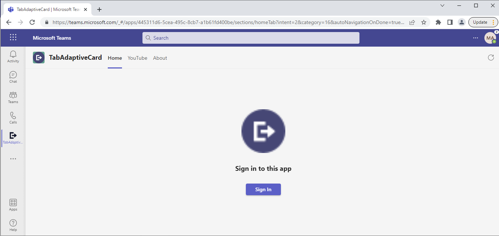
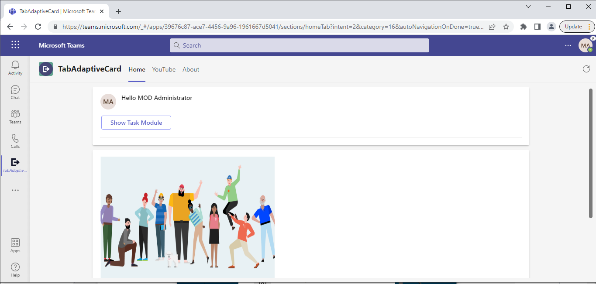

# Tabs with Adaptive Cards

This App talks about the Teams tab which displays Adaptive card with CSharp.

This feature shown in this sample is in Public Developer Preview and is supported in desktop and mobile.

> NOTE: Adaptive Card tabs will be deprecated in the new Microsoft Teams. Apps are expected to be available in the new Microsoft Teams by June 2023. If your app is using Adaptive Card tabs, it's recommended to rebuild the tab as a web-based tab. For more information, see [Build tabs for Teams](https://learn.microsoft.com/en-gb/microsoftteams/platform/tabs/what-are-tabs?tabs=desktop).

## Included Features
* Tabs
* Adaptive Cards (in tabs)

## Interaction with app


## Try it yourself - experience the App in your Microsoft Teams client
Please find below demo manifest which is deployed on Microsoft Azure and you can try it yourself by uploading the app package (.zip file link below) to your teams and/or as a personal app. (Sideloading must be enabled for your tenant, [see steps here](https://docs.microsoft.com/microsoftteams/platform/concepts/build-and-test/prepare-your-o365-tenant#enable-custom-teams-apps-and-turn-on-custom-app-uploading)).

**Tabs with Adaptive Cards:** [Manifest](/samples/tab-adaptive-cards/csharp/demo-manifest/tab-adaptive-card.zip)

## Prerequisites

- [.NET Core SDK](https://dotnet.microsoft.com/download) version 6.0

  ```bash
  # determine dotnet version
  dotnet --version
  ```
- Publicly addressable https url or tunnel such as [ngrok](https://ngrok.com/download) or [Tunnel Relay](https://github.com/OfficeDev/microsoft-teams-tunnelrelay) 

## Setup
1. Register a new application in the [Azure Active Directory – App Registrations](https://go.microsoft.com/fwlink/?linkid=2083908) portal.
  -  Select the **Set** link to generate the Application ID URI in the form of `api://{base-url}/botid-{AppID}`. Insert your fully qualified domain name (with a forward slash "/" appended to the end) between the double forward slashes and the GUID. The entire ID should have the form of: `api://fully-qualified-domain-name/botid-{AppID}`
    * ex: `api://%ngrokDomain%.ngrok-free.app/botid-00000000-0000-0000-0000-000000000000`.
  - Navigate to **Authentication**
    If an app hasn't been granted IT admin consent, users will have to provide consent the first time they use an app.
  - Set a redirect URI:
    * Select **Add a platform**.
    * Select **web**.
    * Enter the **redirect URI** for the app in the following format: `https://{Base_Url}/auth-end`. This will be the page where a successful implicit grant flow will redirect the user.
  - Set another redirect URI:
    * Select **Add a platform**.
    * Select **web**.
    * Enter the **redirect URI** `https://token.botframework.com/.auth/web/redirect`. This will be use for bot authenticaiton. 

2. Setup for Bot
- Also, register a bot with Azure Bot Service, following the instructions [here](https://docs.microsoft.com/azure/bot-service/bot-service-quickstart-registration?view=azure-bot-service-3.0).
- Ensure that you've [enabled the Teams Channel](https://docs.microsoft.com/azure/bot-service/channel-connect-teams?view=azure-bot-service-4.0)
- While registering the bot, use `https://<your_ngrok_url>/api/messages` as the messaging endpoint.

    > NOTE: When you create your app registration, you will create an App ID and App password - make sure you keep these for later.
    
- In the Azure Portal, navigate back to the Azure Bot resource created (https://learn.microsoft.com/microsoftteams/platform/bots/how-to/authentication/add-authentication?tabs=dotnet%2Cdotnet-sample#azure-ad-v2)
  -Switch to the "Settings" blade and click "Add Setting" under the OAuth Connection Settings section
  - Enter a name for your new Connection setting.  
    - In the Service Provider dropdown, select Azure Active Directory V2
    - Enter in the client id and client secret obtained in step 1 and 1
    - For the Token Exchange URL use the Application ID URL obtained in step 1
    - Specify "common" as the Tenant ID
    - Add all the scopes configured when specifying permissions to downstream APIs in step 1
    - Click "Save"

3. Setup NGROK
- Run ngrok - point to port 3978

```bash
# ngrok http 3978 --host-header="localhost:3978"
```

4. Setup for code

- Clone the repository

    ```bash
    git clone https://github.com/OfficeDev/Microsoft-Teams-Samples.git
    ```

- Modify the `/appsettings.json` and fill in the following details:
  - `{{ Bot Id }}` - Generated from Step 1 while doing AAd app registration in Azure portal.
  - `{{ Bot Password}}` - Generated from Step 1, also referred to as Client secret
  - `{{ApplicationBaseUrl}}` - Your application's base url. E.g. https://12345.ngrok-free.app if you are using ngrok.
  - `{{ Connection Name  }}` - For the connection name step 2 and also refer In the Azure Portal, navigate back to the Azure Bot resource created (https://learn.microsoft.com/microsoftteams/platform/bots/how-to/authentication/add-authentication?tabs=dotnet%2Cdotnet-sample#azure-ad-v2)

- Run the bot from a terminal or from Visual Studio:

- In a terminal, navigate to `TabWithAdpativeCardFlow`

    ```bash
    # change into project folder
    cd # TabWithAdpativeCardFlow
    ```

- Run the bot from a terminal or from Visual Studio, choose option A or B.

  A) From a terminal

  ```bash
  # run the bot
  dotnet run
  ```

  B) Or from Visual Studio

  - Launch Visual Studio
  - File -> Open -> Project/Solution
  - Navigate to `TabWithAdpativeCardFlow` folder
  - Select `TabWithAdpativeCardFlow.csproj` file
  - Press `F5` to run the project

5. Setup Manifest for Teams
- __*This step is specific to Teams.*__
    - **Edit** the `manifest.json` contained in the ./AppPackage folder to replace your Microsoft App Id (that was created when you registered your app registration earlier) *everywhere* you see the place holder string `{{Microsoft-App-Id}}` (depending on the scenario the Microsoft App Id may occur multiple times in the `manifest.json`)
    - **Edit** the `manifest.json` for `validDomains` and replace `{{domain-name}}` with base Url of your domain. E.g. if you are using ngrok it would be `https://1234.ngrok-free.app` then your domain-name will be `1234.ngrok-free.app`.
    - **Zip** up the contents of the `AppPackage` folder to create a `manifest.zip` (Make sure that zip file does not contains any subfolder otherwise you will get error while uploading your .zip package)

- Upload the manifest.zip to Teams (in the Apps view click "Upload a custom app")
   - Go to Microsoft Teams. From the lower left corner, select Apps
   - From the lower left corner, choose Upload a custom App
   - Go to your project directory, the ./AppPackage folder, select the zip folder, and choose Open.
   - Select Add in the pop-up dialog box. Your app is uploaded to Teams.

**Note**: If you are facing any issue in your app, please uncomment [this](https://github.com/OfficeDev/Microsoft-Teams-Samples/blob/main/samples/tab-adaptive-cards/csharp/TabWithAdpativeCardFlow/AdapterWithErrorHandler.cs#L30) line and put your debugger for local debug.

## Interacting with the tab in Teams
    You can use this tab by following the below steps:
    - In the navigation bar located at the far left in Teams, select the ellipses ●●● and choose your app from the list.

## Running the sample

- Tab showing Adaptive card with action controls.







## Deploy the bot to Azure

To learn more about deploying a bot to Azure, see [Deploy your bot to Azure](https://aka.ms/azuredeployment) for a complete list of deployment instructions.

## Further reading

- [Tab adaptive card](https://learn.microsoft.com/microsoftteams/platform/tabs/how-to/build-adaptive-card-tabs)
- [Bot Framework Documentation](https://docs.botframework.com)
- [Bot Basics](https://docs.microsoft.com/azure/bot-service/bot-builder-basics?view=azure-bot-service-4.0)
- [Azure Bot Service Introduction](https://docs.microsoft.com/azure/bot-service/bot-service-overview-introduction?view=azure-bot-service-4.0)
- [Azure Bot Service Documentation](https://docs.microsoft.com/azure/bot-service/?view=azure-bot-service-4.0)

